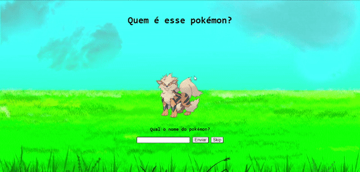

# Pokémon

Um pequeno jogo de pergunta e resposta;

O jogo consiste em digitar o nome do pokémon mostrado na tela no campo de texto, a cada acerto **10 (dez)** pontos são ganhos e a cada erro **uma** tentativa é perdida;

Com **40 (quarenta)** pontos é possível **skipar (pular)** um pokémon;

O jogador possui **4 (quatro)** tentativas no total;

Ganha-se o jogo acertando **todos** os pokémons.

# Overview

